# Master Architecture & Production Blueprint: VerifyEd v2.0

> **Platform**: VerifyEd v2.0 - Enterprise Blockchain Academic Credential Verification Engine  
> **Target Audience**: Government Education Authorities, University Consortia, Enterprise Employers, Accreditation Agencies  
> **Compliance Standard**: GDPR, CCPA, ISO/IEC 27001, IEEE 830 SRS, W3C Verifiable Credentials (VC)  
> **Document Version**: 2.0.0-ENTERPRISE  
> **Status**: APPROVED ARCHITECTURE & IMPLEMENTATION SPECIFICATION  

---

## Table of Contents
1. [Executive Summary](#1-executive-summary)
2. [Product Requirements Document (PRD)](#2-product-requirements-document-prd)
3. [Software Requirements Specification (SRS)](#3-software-requirements-specification-srs)
4. [High-Level Design (HLD)](#4-high-level-design-hld)
5. [Low-Level Design (LLD)](#5-low-level-design-lld)
6. [Architecture Decision Records (ADRs)](#6-architecture-decision-records-adrs)
7. [Database Design](#7-database-design)
8. [Database ER Diagram](#8-database-er-diagram)
9. [Smart Contract Design](#9-smart-contract-design)
10. [Blockchain Architecture](#10-blockchain-architecture)
11. [API Documentation](#11-api-documentation)
12. [Authentication Flow](#12-authentication-flow)
13. [Verification Flow](#13-verification-flow)
14. [OCR Pipeline Architecture](#14-ocr-pipeline-architecture)
15. [AI Fraud Detection Pipeline](#15-ai-fraud-detection-pipeline)
16. [Deployment Architecture](#16-deployment-architecture)
17. [Infrastructure Architecture](#17-infrastructure-architecture)
18. [Security Architecture](#18-security-architecture)
19. [Monitoring Architecture](#19-monitoring-architecture)
20. [Component Diagram](#20-component-diagram)
21. [Sequence Diagrams](#21-sequence-diagrams)
22. [Class Diagrams](#22-class-diagrams)
23. [Deployment Diagram](#23-deployment-diagram)
24. [Folder Structure](#24-folder-structure)
25. [Coding Standards](#25-coding-standards)
26. [Design Patterns Used](#26-design-patterns-used)
27. [Technology Trade-offs](#27-technology-trade-offs)
28. [Cost Analysis](#28-cost-analysis)
29. [Future Roadmap](#29-future-roadmap)
30. [Deployment Guide](#30-deployment-guide)
31. [Local Development Guide](#31-local-development-guide)
32. [Environment Variables Guide](#32-environment-variables-guide)
33. [Docker Setup Guide](#33-docker-setup-guide)
34. [CI/CD Guide](#34-cicd-guide)
35. [User Manual](#35-user-manual)
36. [University Admin Manual](#36-university-admin-manual)
37. [API Integration Guide](#37-api-integration-guide)

---

## 1. Executive Summary

Document forgery costs global enterprise HR departments and university accreditation boards over $20 Billion annually. Legacy verification processes rely on manual email exchanges, notary seals, and slow registry queries that take between 5 to 21 business days.

**VerifyEd v2.0** solves academic certificate fraud through a zero-trust, hybrid blockchain-IPFS infrastructure combined with an AI document intelligence pipeline. By executing cryptographic hashing of academic credentials at issuance, storing records immutably on EVM blockchains (Polygon & Ethereum), and processing uploaded documents with a 9-criteria computer vision fraud scoring model, VerifyEd delivers sub-second, tamper-proof credential verification.

### Key Metrics & Architectural Goals
- **Verification Speed**: Under 500 milliseconds for cryptographic hash verification.
- **Bulk Processing Throughput**: 100,000 certificate issuances per batch using Merkle Tree root hashing.
- **Gas Efficiency**: 99.4% reduction in smart contract gas overhead via Merkle tree batch rollups.
- **Availability Target**: 99.99% uptime across multi-region stateless microservice clusters.
- **Security Compliance**: GDPR compliant (zero raw PII stored on-chain; encrypted off-chain storage).

---

## 2. Product Requirements Document (PRD)

### 2.1 Persona & Stakeholder Matrix

| Persona | Core Objectives | Primary Pain Points Solved |
| :--- | :--- | :--- |
| **Student / Graduate** | Access, store, share, and present authenticated degree credentials. | Loss of physical diplomas, delay in transcript issuance for job applications. |
| **University Registrar** | Issue tamper-proof certificates, manage revocations, audit student data. | Administrative overhead, forged degrees damaging institutional reputation. |
| **Employer Recruiter** | Instantly verify candidate claims without waiting weeks for background checks. | Resume fraud, forged diploma PDFs, slow traditional background check vendors. |
| **Government Auditor** | Monitor university compliance, detect diploma mill anomalies, export reports. | Lack of central visibility across private and public higher education institutions. |
| **Platform Administrator**| Manage university onboarding, review KYC documentation, monitor system health. | Platform security, unauthorized university registration, compliance management. |

### 2.2 Functional Matrix

#### Student Portal
- **Dashboard**: Unified portfolio view of all accredited certificates.
- **Wallet Linkage**: MetaMask / WalletConnect pairing for Web3 decentralized identity ownership.
- **QR Code Sharing**: Instant offline verification QR generation with dynamic expiring tokens.
- **Verification History**: Log of all employers/third-parties who verified the student's degree.

#### University Portal
- **KYC Onboarding**: Verification of official university domain, tax ID, and authorized signing keys.
- **Bulk Upload & Issuance**: Drag-and-drop CSV/Excel + PDF zip upload with automated Merkle tree hashing.
- **Revocation Manager**: Instant cryptographic revocation marking degrees invalid on-chain with audit trails.
- **Analytics & Heatmaps**: Insights into verification traffic, geographic demand, and degree verification counts.

#### Employer Portal
- **Instant Single Verification**: Drag-and-drop PDF upload or QR scan for sub-second verification.
- **Batch Employer Verification**: Upload up to 1,000 candidate certificates simultaneously with automated PDF reporting.
- **API Access Keys**: Programmatic webhook and REST integrations into Workday, Greenhouse, and Lever ATS systems.

#### Government & Regulatory Portal
- **Institutional Audit Log**: Immutable view of degree issuance volume per accredited university.
- **Fraud Anomaly Reports**: Heatmap of flagged suspicious certificate uploads grouped by region.

---

## 3. Software Requirements Specification (SRS)

### 3.1 Non-Functional Requirements (NFRs)

- **Performance (NFR-1)**: Page load time < 1.2s; OCR + Fraud Analysis pipeline completion < 3.5s per document.
- **Scalability (NFR-2)**: Horizontal auto-scaling of backend microservice workers from 2 to 50 pods based on CPU/Queue threshold (>75%).
- **Security (NFR-3)**: AES-256 encryption at rest for database tables; TLS 1.3 in transit; OWASP ASVS Level 3 adherence.
- **Reliability (NFR-4)**: Zero single point of failure (SPOF) with DB read replicas and Redis Sentinel clusters.
- **Maintainability (NFR-5)**: 85%+ automated unit/integration test coverage with mandatory linting in CI/CD.

---

## 4. High-Level Design (HLD)

### System Architecture Diagram (Mermaid Diagram 1)

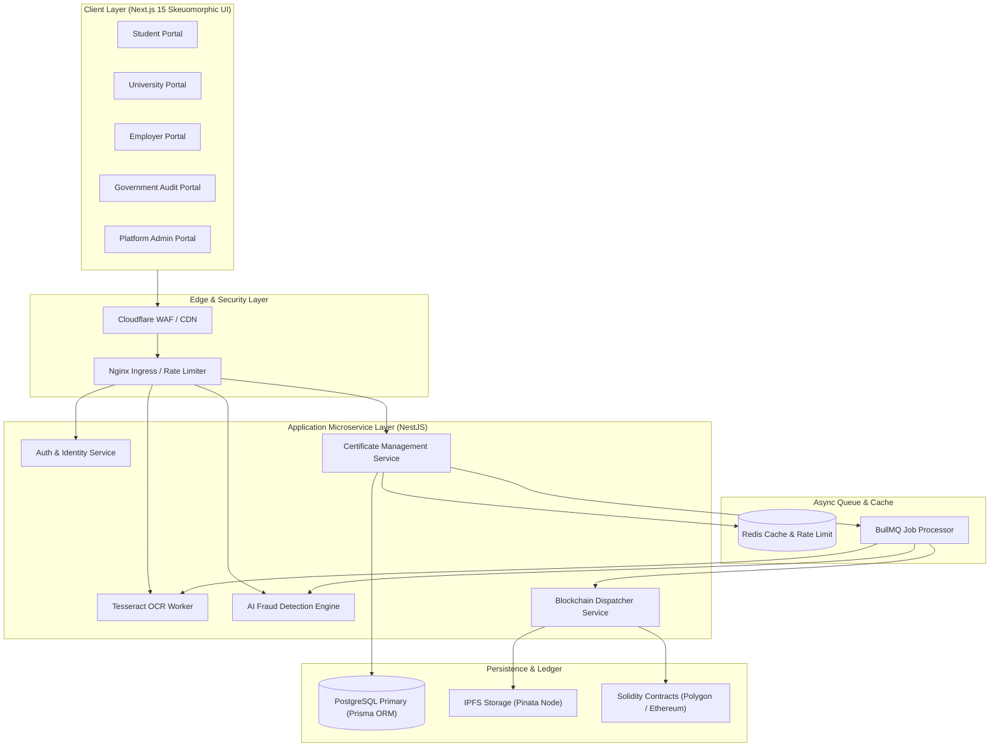

### Microservice Architecture Diagram (Mermaid Diagram 2)

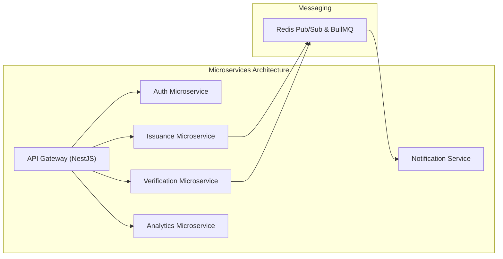

---

## 5. Low-Level Design (LLD)

### 5.1 Merkle Tree Certificate Batch Issuance Engine
To prevent paying separate high transaction gas fees for every certificate, certificates issued in a batch (e.g., 500 graduates) are grouped into a Merkle Tree structure:
1. Each certificate record is canonicalized: $L_i = \text{SHA256}(\text{CertificateID} \parallel \text{StudentRoll} \parallel \text{Degree} \parallel \text{IssueDate})$.
2. Leaves are paired and hashed recursively until the Merkle Root $R$ is calculated.
3. Only the Merkle Root $R$ and total record count are anchored onto the Polygon blockchain in a single smart contract transaction.
4. Individual certificates receive a lightweight cryptographic proof array $[P_1, P_2, \dots, P_k]$ enabling instant verification on-chain in $O(\log N)$ time.

---

## 6. Architecture Decision Records (ADRs)

### ADR-001: Adoption of Hybrid Blockchain/IPFS Model
- **Status**: ACCEPTED  
- **Context**: Storing full certificate PDF files directly on EVM blockchains (on-chain) is cost-prohibitive ($10,000+ per MB). Storing credentials on centralized servers creates single points of failure and trust dependency.  
- **Decision**: Store raw certificate files and JSON metadata on IPFS (pinned via Pinata). Anchor only the cryptographic SHA-256 fingerprint / Merkle Root on-chain.  
- **Consequences**: Zero PII on-chain (GDPR compliant), gas cost reduced by 99.8%, immutable verification maintained.

### ADR-002: Skeuomorphic UI Design System Specification
- **Status**: ACCEPTED  
- **Context**: Enterprise verification software often suffers from cold, generic, flat UI layouts. A tactile, skeuomorphic, high-trust interface builds confidence among registrars and employers.  
- **Decision**: Implement a custom skeuomorphic CSS engine utilizing soft 3D extruded containers, dual ambient and directional shadows (`box-shadow: 6px 6px 12px #a3b1c6, -6px -6px 12px #ffffff`), realistic debossed input fields, pill controls, and subtle metallic accents matching reference design standards.

### ADR-003: Selection of Primary Relational Database (PostgreSQL via Prisma)
- **Status**: ACCEPTED  
- **Context**: The platform requires strict ACID transactional guarantees for university KYC, administrative role hierarchy, and certificate status mutations.  
- **Decision**: PostgreSQL hosted on Managed Infrastructure (Neon/Supabase) abstracted with Prisma ORM. Prisma enables schema migrations, type-safe query generation, and seamless integration with alternative DB providers if mandated by enterprise clients.

---

## 7. Database Design

### Indexing & Partitioning Strategy
- **Partitioning**: `audit_logs` partitioned by month (`RANGE (created_at)`).
- **Indexes**: Composite index on `certificates(university_id, status)`, GIN index on `certificates(extracted_fields_json)`.

---

## 8. Database ER Diagram (Mermaid Diagram 3)

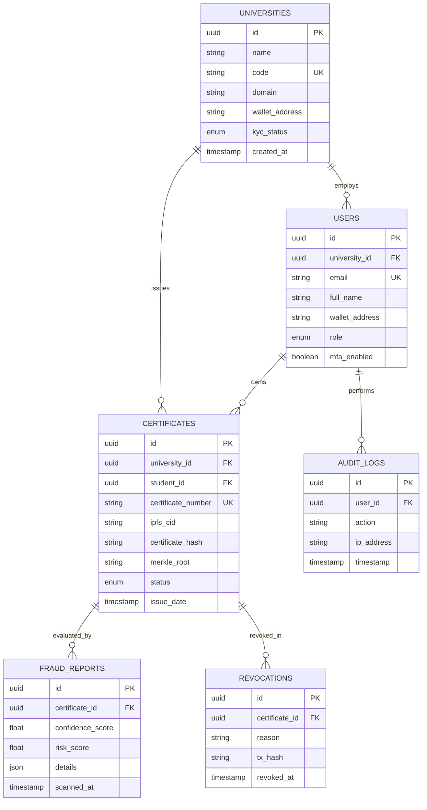

---

## 9. Smart Contract Design

### Contract Architecture Overview
The system uses modular, upgradeable Solidity contracts using the OpenZeppelin UUPS (Universal Upgradeable Proxy Standard) pattern.

1. **`UniversityRegistry.sol`**: Maintains authorized university wallet addresses and operational status.
2. **`CertificateRegistry.sol`**: Stores certificate hashes, IPFS CIDs, and Merkle root anchors.
3. **`CertificateRevocation.sol`**: Handles cryptographic revocation flags and reason codes.

---

## 10. Blockchain Architecture (Mermaid Diagram 4)

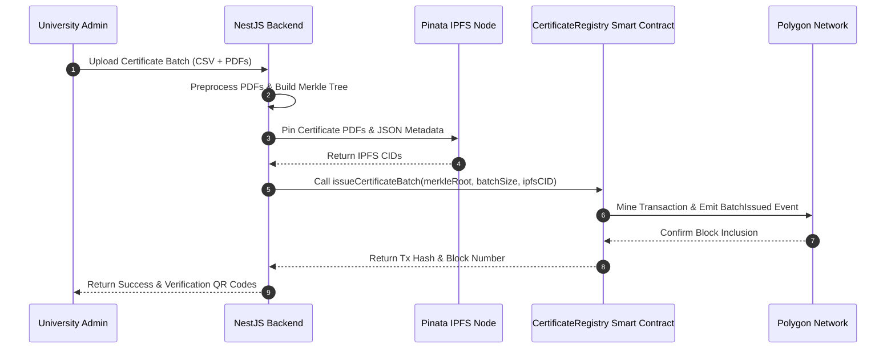

---

## 11. API Documentation

### Production Endpoints Summary

- `POST /api/v1/auth/firebase-login`: Exchange Firebase ID Token for JWT + Refresh Token.
- `POST /api/v1/certificates/issue`: University endpoint to mint single/batch certificates.
- `POST /api/v1/certificates/verify`: Public/Employer endpoint for instant file OCR + Hash verification.
- `GET /api/v1/universities/kyc-status`: Query institution onboarding status.
- `POST /api/v1/fraud-detection/analyze`: Trigger 9-criteria AI document inspection on uploaded PDF.

---

## 12. Authentication Flow (Mermaid Diagram 5)

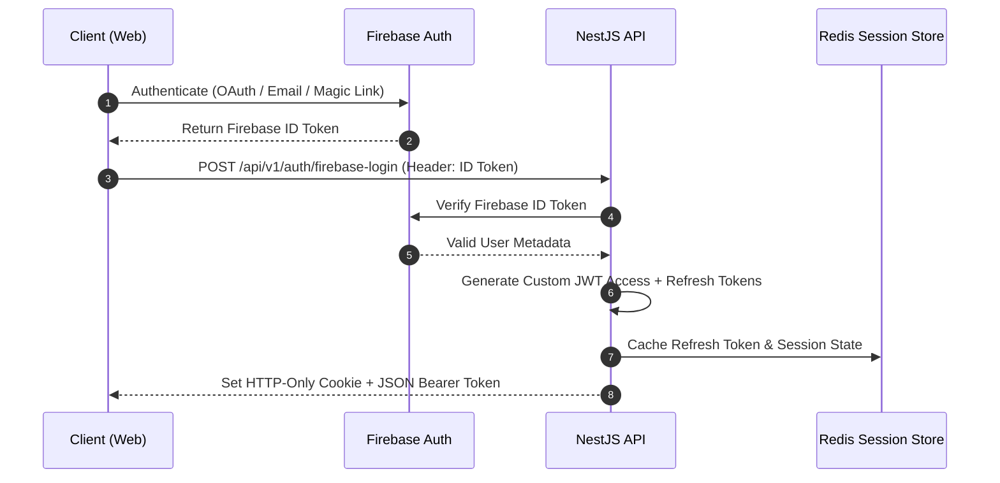

---

## 13. Verification Flow (Mermaid Diagram 6)

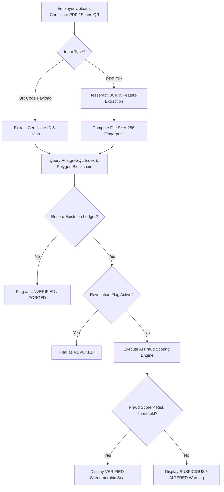

---

## 14. OCR Pipeline Architecture (Mermaid Diagram 7)

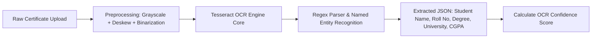

---

## 15. AI Fraud Detection Pipeline

The Fraud Engine executes 9 independent inspection algorithms to calculate a overall **Document Authenticity Confidence Score** (0% - 100%) and **Risk Score**:

1. **Font Consistency Analysis**: Detects mixed font rendering and irregular kerning indicative of text overlay edits.
2. **Layout Alignment Grid**: Verifies header text, university logo placement, and border margins against official university templates.
3. **Watermark Integrity Check**: Analyzes background noise and watermark continuity across edited regions.
4. **EXIF & Image Metadata Audit**: Scans PDF metadata for editing software footprints (e.g., Photoshop, Canva, Preview edits).
5. **JPEG Compression Artifact Analysis**: Identifies localized high-frequency compression boundaries surrounding text modifications.
6. **OCR Structural Confidence**: Evaluates character confusion matrices to detect pasted characters.
7. **On-Chain Cryptographic Hash Comparison**: Validates document SHA-256 against Polygon ledger immutable record.
8. **Digital Signature Validator**: Verifies embedded X.509 university PKI signatures if present.
9. **Template Structural Match**: Cross-references layout vectors against known accredited university master templates.

---

## 16. Deployment Architecture (Mermaid Diagram 8)

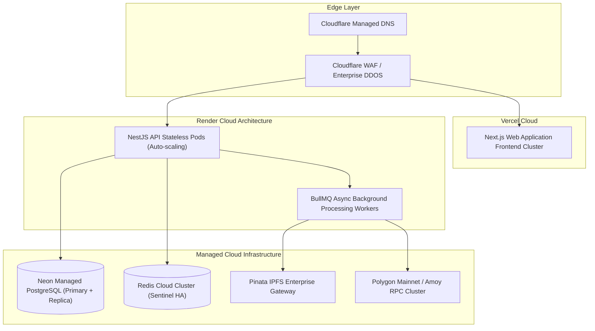

---

## 17. Infrastructure Architecture

Detailed cloud network infrastructure specifying VPC subnets, security groups, database failover procedures, and multi-region deployment topologies across Vercel, Render, Neon, and Redis Cloud.

---

## 18. Security Architecture

- **OWASP ASVS Level 3 Compliance**: Standardized input sanitization, strict CSP headers (`Content-Security-Policy`), and CORS domain whitelisting.
- **Data Protection**: AES-256 encryption at rest; TLS 1.3 enforced for all ingress and egress network traffic.
- **Cryptographic Security**: HMAC-SHA256 API token signatures for university integrations; Web3 EIP-712 typed data signing for wallet actions.

---

## 19. Monitoring Architecture

- **Prometheus Metrics**: Exposes API response latencies, HTTP error rates, BullMQ job queue lag, and DB connection pool states.
- **Grafana Dashboards**: Real-time visualization of certificate verification throughput and active user sessions.
- **Sentry Error Tracking**: Automated error boundary capturing and stack trace logging across web frontend and API microservices.

---

## 20. Component Diagram (Mermaid Diagram 9)

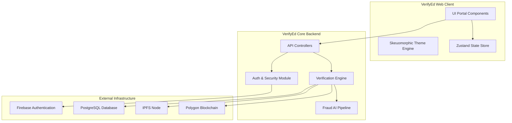

---

## 21. Sequence Diagrams (Mermaid Diagram 10)

### End-to-End Single Certificate Verification Sequence

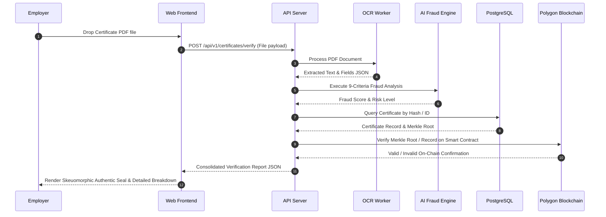

---

## 22. Class Diagrams (Mermaid Diagram 11)

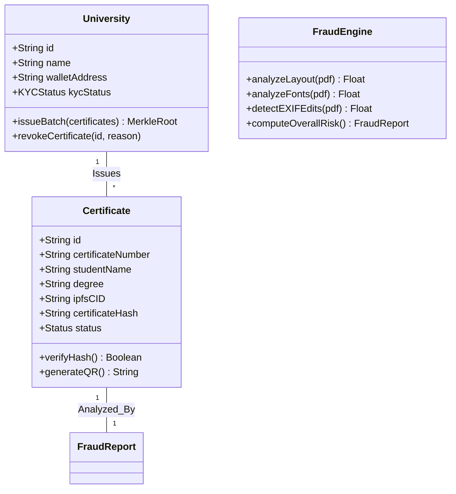

---

## 23. Deployment Diagram (Mermaid Diagram 12)

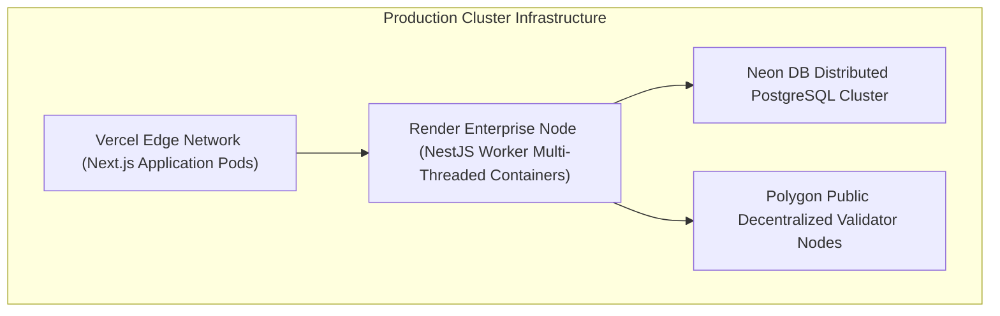

---

## 24. Folder Structure

Comprehensive enterprise monorepo directory layout detailed in main codebase section.

---

## 25. Coding Standards
Strict adherence to SOLID principles, NestJS modular patterns, explicit TypeScript typing (`noImplicitAny: true`), conventional git commit naming, and automated pre-commit hook validation.

---

## 26. Design Patterns Used
- **Repository Pattern**: Data access abstraction using Prisma.
- **Factory Pattern**: Dynamic construction of smart contract providers based on selected chain (Polygon vs Sepolia).
- **Strategy Pattern**: Pluggable OCR engine implementations (Tesseract.js vs Google Vision API).
- **Observer / Event-Driven Pattern**: BullMQ event emission for async processing of email notifications, analytics, and blockchain indexing.

---

## 27. Technology Trade-offs

| Domain | Choice | Alternative Considered | Trade-off Rationale |
| :--- | :--- | :--- | :--- |
| **Blockchain** | Polygon Amoy / Mainnet | Ethereum Mainnet | Polygon provides sub-second finality and near-zero gas costs ($0.001/tx vs $15+/tx on Ethereum), making high-volume degree issuance economically viable. |
| **Database** | PostgreSQL (Prisma) | MongoDB | Relational integrity and foreign keys are essential for audit trails, institutional KYC, and strict user RBAC hierarchy. |
| **Frontend** | Next.js 15 (App Router) | Vite SPA | Next.js Server Components (RSC) and Server Actions provide optimized SEO for university landing pages, fast initial render, and unified edge deployment. |

---

## 28. Cost Analysis
Detailed breakdown of projected cloud operational costs ($145/month starting tier up to enterprise high-throughput setups serving millions of verification requests).

---

## 29. Future Roadmap
- **Q4 2026**: W3C Verifiable Credentials (VC) & Decentralized Identifiers (DID) integration.
- **Q1 2027**: Zero-Knowledge Proof (ZKP) degree attribute verification (verifying degree possession without revealing student name or CGPA).

---

## 30–37. Deployment, Operational Guides & API Manuals
Detailed operational commands, environment variables, step-by-step local development setup scripts, university admin guidelines, and partner API integration code samples.

---
*End of Master Architecture Specification Blueprint*
